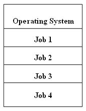

## 운영체제의 발전 과정

운영체제의 발전 과정은 3단계로 구분할 수 있다.

- phase 1: 50~60년대
- phase 2: 60~90년대
- phase 3: 90년대~

## phase 1 시기의 특징

- 비싼 하드웨어에 비해 저렴한 노동력
- OS 역할을 인간이 수행(human operator)
- 천공 카드를 사용한 프로그래밍

**문제점**: 비싼 하드웨어를 효율적으로 사용할 수 없다. CPU의 utilization을 높일 수 있는 방법이 필요했다.

**job**: 일의 기본 단위(작업)

## OS의 등장

**OS의 역할**

- 사용자로부터 카드 덱을 수령
- 카드 덱을 컴퓨터 시스템에 로딩하고 수행
- 수행 결과를 프린터로 출력
- 출력된 결과물을 사용자에게 전달.

**job-to-job transition**: OS가 한 job을 처리하고 다음 job을 받아들이는 과정. 이 시기에는 인간이 이 작업을 수행했기 때문에 job-to-job transition이 느렸다. 속도 해결의 필요성이 대두되었다. -batch monitor의 등장

**batch monitor**: 테이프에 읽혀진 batch job(작업의 묶음)

**해결 방안**: 여러개의 카드 덱(batch job)을 하나의 tape에 기록하고, 컴퓨터 시스템은 이 tape에 있는 job들을 순차적으로 수행함으로써 operator의 느린 job-to-job 전환 속도 문제를 해결.

**또 다른 문제점**: CPU가 입출력을 관장하므로 입출력 중에는 CPU가 idle하다. CPU가 입출력중 다른 작업을 할 수 있다면 CPU의 사용성을 높일 수 있다.

=> 입출력 작업을 관리하는 I/O 채널의 도입으로 CPU는 입출력의 시작과 끝만 관리하고 그 사이에는 다른 작업을 수행할 수 있도록 하였다. (interrupt mechanism의 등장. 비 동기적 작업 처리)

## 입출력 방식

- 동기적 입출력: CPU가 연산 중 입출력이 시작되었을 때, 해당 입출력 작업이 끝난 이후에 다음 연산을 시작.
- 비동기적 입출력: 입출력이 시작되었을 때, 입출력의 결과를 기다리지 않고도 다음 연산을 시작.

대부분의 input operation은 동기적 입출력, 대부분의 Output operation은 비동기적 입출력.

batch monitor의 한계: 비동기적 입출력의 경우 CPU의 사용성을 높일 수 있지만, 동기적 입출력의 경우 여전히 CPU가 idle하다.

=> 입출력 CPU가 다른 job을 동시에 할 수 있다면 CPU의 효율적인 사용이 가능하다. => **Multiprogrammed batch monitor**

**Multi-programming**: 한 번에 1개 이상의 Active한 job을 수행. (메인 메모리에 여러개의 job이 존재)

**active job**: 수행을 시작하였고 종료되지 않은 job.

**degree of multi-programming**: 현재 메모리에 존재하는 active job의 수

## 멀티 프로그래밍

**멀티 프로그래밍 메모리 구조**

**멀티 프로그래밍의 새로운 문제**

- memory protection
- memory relocation
- concurrent programming

**memory protection**: 한 job이 다른 job이나 os의 메모리 영역을 참조함으로 발생하는 문제를 해결해야 한다.

**memory relocation**: 이전에는 하나의 job이 메모리의 특정 영역(절대 주소)에 로드되었지만 멀티 프로그래밍을 위해서는 여러개의 job이 수행되야 하므로 메모리의 임의의 주소에서도 문제없이 수행될 수 있어야 한다.

- **base register**: job이 위치하는 메모리의 시작 주소를 저장.
- **bound register**: job의 크기를 저장.

하나의 job이 메모리에서 차지하는 공간은 base register ~ base register + bound register.

두 레지스터를 통하여 job이 참조할 메모리가 자신에게 속한 메모리 영역인지 확인함으로 memory protection이 가능하다.

## 메모리 주소의 구분

- 논리 주소: 프로그램에 의해 CPU가 바로 생성하는 주소
- 물리 주소: 일련의 변환 과정을 거친 최종 메인 메모리의 주소

## MMU

- 논리 주소를 물리 주소로 변환 및 protection check를 수행하는 unit.
- 하드웨어로 구현.(SW로 구현시 2가지 문제 발생. 메모리 참조에 필요한 명령어의 증가로 성능의 하락 및 자신이 위치하는 주소의 검증을 위한 재귀 호출의 문제가 발생)
- 일반 사용자가 mmu에 접근이 가능하다면 base 레지스터를 건드리는 등 메모리 문제가 발생 가능 하므로 OS만 접근할 수 있어야 한다.(privileged instruction)
- OS의 관점에서 MMU는 programmable 한 entity.
- 하드웨어 사용의 효율을 위해 OS가 등장 하였고 OS의 보조를 위해 MMU라는 하드웨어가 등장하는 것처럼 OS와 하드웨어는 상호 발전한다.

